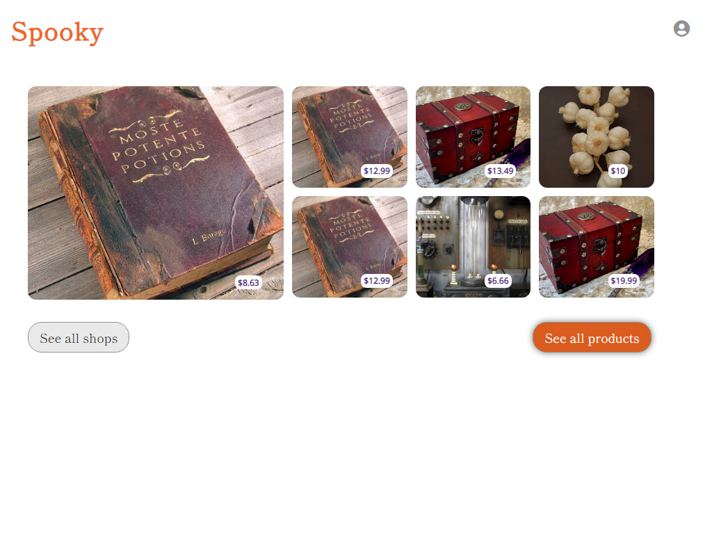
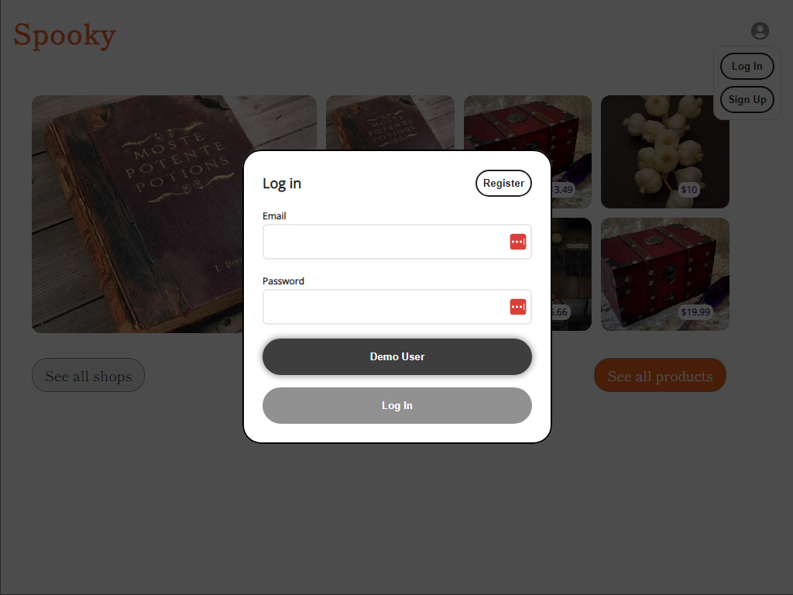
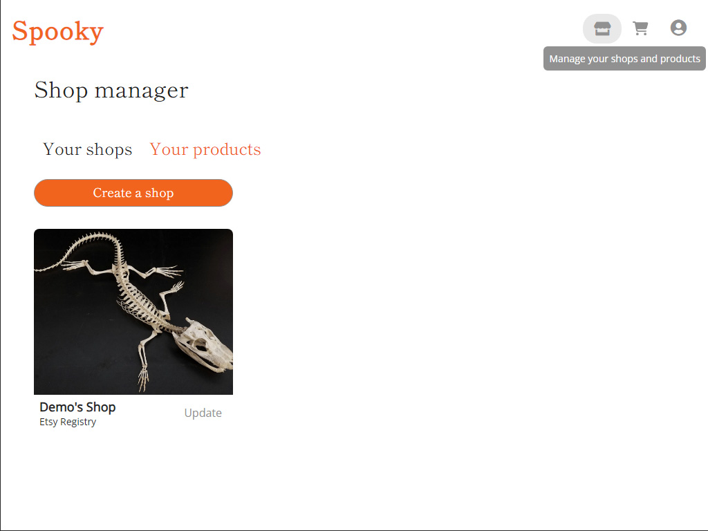
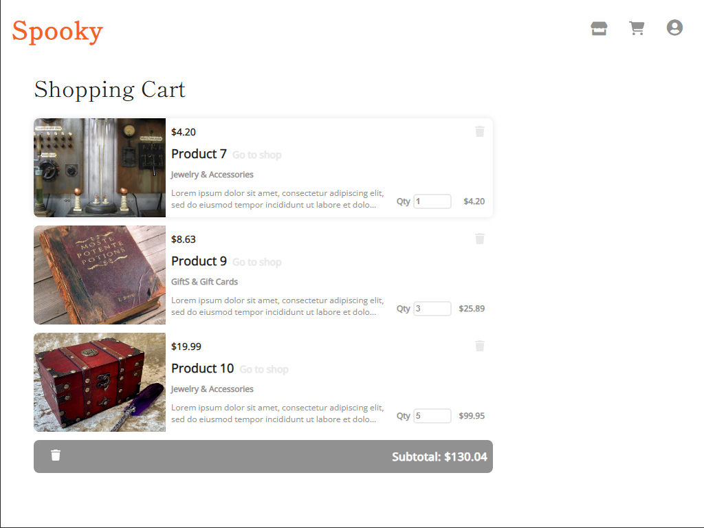

# Spooky

## Project Summary
In this project, I've structured a user interface for an ecommerce application. Users have full control over a Shops feature to display their online retail page,a Products feature to populate shops, and Shopping Cart to list a User's desired items and modify which items and amounts are included. To display these features, users may upload image files either to set the style of their shop or depict a product with up to five inputs.

## Screenshots
### Landing

### Login

### Shop Manager

### Product Details

### Shopping Cart


## Technologies/Languages/Plugins/APIs Used
* HTML, CSS, JavaScript, Python
* React.js
* Node.js
* Express.js
* PostgreSQL
* Amazon Web Services S3 Bucket

## To-Dos/Future Features

* Implement Google Oauth
* CSS adjustments
* Reviews full CRUD
* Implement Search feature

## How to Build/Run the Project
To build this application locally, you will need the following:

* Node.js v16.20.1
* Python 3.9.4
* Python pip
* Amazon Web Services account and S3 Bucket (Bucket name, key, and secret key are required for the development environment variables)

Instructions:

1. Clone this repository (only branch: main)

2. Install dependencies

      ```bash
      pipenv install -r requirements.txt
      ```

3. Create a **.env** file based on the example with proper settings for your
   development environment

4. Make sure the SQLite3 database connection URL is in the **.env** file

5. This starter organizes all tables inside the `flask_schema` schema, defined
   by the `SCHEMA` environment variable.  Replace the value for
   `SCHEMA` with a unique name, **making sure you use the snake_case
   convention**.

6. Get into your pipenv, migrate your database, seed your database, and run your Flask app

   ```bash
   pipenv shell
   ```

   ```bash
   flask db upgrade
   ```

   ```bash
   flask seed all
   ```

   ```bash
   flask run
   ```

7. After seeding, to initiate the applicaiton from outside of the pipenv, you can use the command:

   ```bash
   pipenv run flask run
   ```
